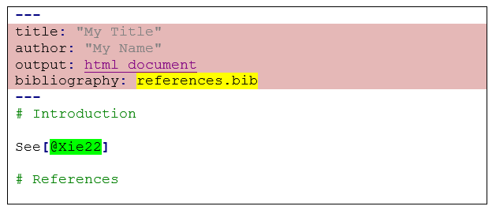
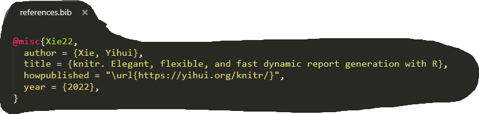
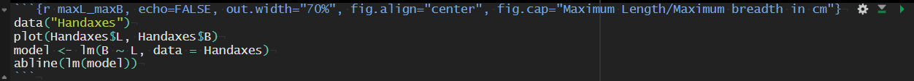
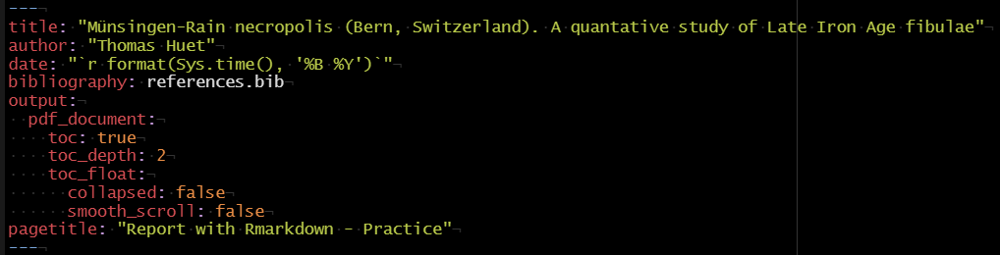

<center>

{width=350px}

</center>

```{r echo=FALSE, eval=FALSE, out.width="50%", fig.align="center", fig.cap="R4Archaeologists"}
## Not run
# install.packages("archdata")
# install.packages("rmarkdown")
# install.packages("tinytex")
# install.packages("bookdown")
# install.packages("dplyr")
# install.packages("leaflet")
# install.packages("plotly")
# install.packages("rgl")
library(archdata)
library(rmarkdown)
library(tinytex)
library(bookdown)
library(dplyr)
library(leaflet)
library(plotly)
library(rgl)
```

# Introduction

**R Markdown** is an authoring framework for data science (AFDS) combining R code with narrative text. AFDS permits to create a computational -- or data-driven -- document, with a notebook interface for report generation. There are others AFDS like  [Jupyter](https://hub.mybinder.turing.ac.uk/user/ipython-ipython-in-depth-qd7itkd2/notebooks/binder/Index.ipynb) in Python, [D3.js](https://d3js.org/) and [Plotly](https://plotly.com/) both in JavaScript.

| AFDS        | Description | Description          |
| ------------| ----------- | -------------------- |
| Rmarkdown   | R           | front-end oriented   |
| Jupyter     | Python      | back-end oriented    |
| D3.js       | JavaScript  | web oriented         |
| Plotly      | JavaScript  | web oriented         |

**R Markdown** use Markdown syntax, supports HTML/CSS tags, BibTex bibliographic references, 3D charts. The main R Markdown packages are:

* {`rmarkdown`} dynamic document
* {`knitr`} designed to be a '*transparent engine for dynamic report generation with R*' [@Xie22]
* {`bookdown`} advanced editing and publishing functions
* {`tinytex`} for LaTeX syntax

## Create a new document

In RStudio:  
&emsp;`File > New file > R Markdown...`  

{width=500px}

The parameters (`Title`, `Author`) can be changed later on the YAML header  


{width=500px}

A new document is created:  


{width=500px}

Run the new document with   knit   

## Navigate
  
  
Use RStudio tools
  
&ensp; knit when save the document 

&ensp; check spelling  

&ensp; knit the document  

&ensp; run [Visual R Markdown](https://rstudio.github.io/visual-markdown-editing/) + other parameters   
  
&ensp;&ensp; new editing tools 

&ensp; create a new code chunk (R, Bash, D3, Python, etc.)

&ensp; run a part or the whole document  

&ensp; publish the document

&ensp; run [Visual R Markdown](https://rstudio.github.io/visual-markdown-editing/) 

# Document structure

R Markdown combines: 

* a [YAML header](#yaml) for the document metadata

* different [code chunks](#chunks) (R code embedded)

* many [narrative parts](#text) (Markdown syntax) with inline R code
  
  
<center>
<table style="align: center;border-collapse:collapse;border:none;margin-left:6.75pt;margin-right:6.75pt;">
    <tbody>
        <tr>
            <td style="width: 147.15pt;border: 1pt solid windowtext;background: rgb(217, 149, 148);padding: 0cm 5.4pt;vertical-align: top;">
                <p style='margin:0cm;font-size:16px;font-family:"Times New Roman",serif;text-align:center;'>YAML<span style="color:black;">&nbsp;header</span></p>
            </td>
        </tr>
        <tr>
            <td style="width: 147.15pt;border-right: 1pt solid windowtext;border-bottom: 1pt solid windowtext;border-left: 1pt solid windowtext;border-image: initial;border-top: none;padding: 0cm 5.4pt;vertical-align: top;">
                <p style='margin:0cm;font-size:16px;font-family:"Times New Roman",serif;text-align:center;'>narrative part</p>
            </td>
        </tr>
        <tr>
            <td style="width: 147.15pt;border-right: 1pt solid windowtext;border-bottom: 1pt solid windowtext;border-left: 1pt solid windowtext;border-image: initial;border-top: none;background: rgb(191, 191, 191);padding: 0cm 5.4pt;vertical-align: top;">
                <p style='margin:0cm;font-size:16px;font-family:"Times New Roman",serif;text-align:center;'><span style='font-size:15px;font-family:"Courier New";color:black;'>R code</span></p>
            </td>
        </tr>
        <tr>
            <td style="width: 147.15pt;border-right: 1pt solid windowtext;border-bottom: 1pt solid windowtext;border-left: 1pt solid windowtext;border-image: initial;border-top: none;padding: 0cm 5.4pt;vertical-align: top;">
                <p style='margin:0cm;font-size:16px;font-family:"Times New Roman",serif;text-align:center;'>narrative part</p>
            </td>
        </tr>
        <tr>
            <td style="width: 147.15pt;border-right: 1pt solid windowtext;border-bottom: 1pt solid windowtext;border-left: 1pt solid windowtext;border-image: initial;border-top: none;background: rgb(191, 191, 191);padding: 0cm 5.4pt;vertical-align: top;">
                <p style='margin:0cm;font-size:16px;font-family:"Times New Roman",serif;text-align:center;'><span style='font-size:15px;font-family:"Courier New";color:black;'>R code</span></p>
            </td>
        </tr>
        <tr>
            <td style="width: 147.15pt;border-right: 1pt solid windowtext;border-bottom: 1pt solid windowtext;border-left: 1pt solid windowtext;border-image: initial;border-top: none;padding: 0cm 5.4pt;vertical-align: top;">
                <p style='margin:0cm;font-size:16px;font-family:"Times New Roman",serif;text-align:center;'><span style='font-size:13px;font-family:"Courier New";'>...</span></p>
            </td>
        </tr>
        <tr>
            <td style="width: 147.15pt;border-right: 1pt solid windowtext;border-bottom: 1pt solid windowtext;border-left: 1pt solid windowtext;border-image: initial;border-top: none;background: rgb(191, 191, 191);padding: 0cm 5.4pt;vertical-align: top;">
                <p style='margin:0cm;font-size:16px;font-family:"Times New Roman",serif;text-align:center;'><span style='font-size:13px;font-family:"Courier New";color:black;'>...</span></p>
            </td>
        </tr>
    </tbody>
</table>  
</center>
  
  
## Narrative parts {#text}

Narrative parts required principally the use of the Markdown syntax, but also supports HTML/CSS code, LaTeX syntax, etc. 


### Markdown syntax

**Markdown is an easy-to-write plain text syntax** used by different code-oriented frameworks:

* [Jupyter](https://hub.mybinder.turing.ac.uk/user/ipython-ipython-in-depth-qd7itkd2/notebooks/binder/Index.ipynb)
* [GitHub](https://github.com/zoometh/oxford/tree/main/R4Archaeologists#rmarkdown)
* [Sketchfab](https://sketchfab.com/3d-models/roche-de-larcher-a5c0771d898d4816950570cd7fb1be37)
* [Slack](https://eamena.slack.com/archives/D02KMQULWVD/p1637257246040200)
* [bookdown](https://martinhinz.github.io/smada2021/book/preface.html)
* [Stackoverflow](https://stackoverflow.com/a/14747656/2854081)
* etc. 

[{width=20px}](https://www.markdownguide.org/basic-syntax/)&ensp; Markdown basic syntax  
[{width=20px}](https://stackedit.io/app#)&ensp; Markdown online editor


#### Titles {-}

```
# Header level 1

## Heading level 2

### Heading level 3

etc.
```

#### Spaces and end of lines {-}


Extra spaces (HTML tags)

* &emsp; `&emsp;` means 4 spaces (= a tabulation)
* &ensp; `&ensp;` means 2 spaces
* &nbsp; `&nbsp;` means 1 space  
  

End of line (`<br>` in HTML) with 2 or more spaces and return, for example:

{width=400px}
  
  
``` 
'Reconnais-toi  
Cette adorable personne c'est toi  
Sous le grand chapeau canotier  
Oeil
Nez  
Ta Bouche  
Voici l’ovale de ta figure  
Ton cou Exquis' (Apollinaire, 1913) 
```

'Reconnais-toi  
Cette adorable personne c'est toi  
Sous le grand chapeau canotier  
Oeil
Nez  
Ta Bouche  
Voici l’ovale de ta figure  
Ton cou Exquis' (Apollinaire, 1913)
  

#### Styling text {-}

| code in R Markdown                                   | Output                                              |
| ---------------------------------------------------- | --------------------------------------------------- |
| `**bold**, __bold__`                                 | **bold**, __bold__                                  |
| `*italic*, _italic_`                                 | *italic*, _italic_                                  |
| ``code``                                             | `code`                                              |
| `hyphen -- inserted -- in a sentence`                | hyphen -- inserted -- in a sentence                 |
| `H~2~O`                                              | H~2~O                                               |
| `10^−19^`                                            | 10^−19^                                             |
| `$$\sum_{i=1}^{n} X^3_i$$`                           | $$\sum_{i=1}^{n} X^3_i$$                            |
|  ...                                                 | ...                                                 |

* comments `>`  

`> I am commented`  
  
> I am commented

* line separator  

```
--- or ***
```

---

A extended part of the text styling can also be done with HTML/CSS


#### Lists {-}

```
- numbered  
  
  1. first element
  2. second element
  3. third element 
```

- numbered  
  
  1. first element
  2. second element
  3. third element  
  
```  
- bullet
  
  * first element
  * second element
  * third element
    - third element - sub 1
    - third element - sub 2
      + third element - sub 2 - subsub 1
      + third element - sub 2 - subsub 2
```

- bullet
  
  * first element
  * second element
  * third element
    - third element - sub 1
    - third element - sub 2
      + third element - sub 2 - subsub 1
      + third element - sub 2 - subsub 2

#### Tables {-}

* simple table

```
| Syntax | Description |
| --- | ----------- |
| Header | Title |
| Paragraph | Text |
```

and 

```
| Syntax      | Description |
| ----------- | ----------- |
| Header      | Title       |
| Paragraph   | Text        |
```

produce the same result:

| Syntax      | Description |
| ----------- | ----------- |
| Header      | Title       |
| Paragraph   | Text        |
  
  
* alignements

```
| Left        |    Center   |         Rigth |
| :---        |    :----:   |          ---: |
| Header      | Title       | Here's this   |
| Paragraph   | Text        | And more      |
```
| Left        |    Center   |         Rigth |
| :---        |    :----:   |          ---: |
| Header      | Title       | Here's this   |
| Paragraph   | Text        | And more      |


#### Hyperlinks {-}

* hyperlinks

`Report with R Markdown, part 2: [Practice](https://zoometh.github.io/oxford/R4A/2_R Markdown_Practice)`  
Report with R Markdown, part 2: [Practice](https://zoometh.github.io/oxford/R4A/2_R Markdown_Practice)  
  
  
`[{width=70px}](https://www.unipi.it/index.php/humanities/item/16574-r4rchaeologists)`  
[{width=70px}](https://www.unipi.it/index.php/humanities/item/16574-r4rchaeologists)  
  
{width=20px}&ensp; Hyperlinks can also be done with HTML/CSS

#### Bookmarks {-}
  
`see chapter [Practice](#practice)`  
see chapter [Practice](#practice)  
  
#### Footnotes {-}

Add footnote to the bottom of the document

`A simple footnote,[^1] or a longer one.[^bignote]`  
A simple footnote,[^1] or a longer one.[^bignote]

[^1]: This is the first footnote.

[^bignote]: Here's one with multiple paragraphs and code.

    Indent paragraphs to include them in the footnote.

    `{ my code }`

    Add as many paragraphs as you like.

```
[^1]: This is the first footnote.

[^bignote]: Here's one with multiple paragraphs and code.

    Indent paragraphs to include them in the footnote.

    `{ my code }`

    Add as many paragraphs as you like.
```


### Call the variables

```{r  echo=TRUE}
library(archdata)
data("Handaxes")
number.of.axes <- nrow(Handaxes)
```

```
'(...) the Furze Platt dataset counts 'r number.of.axes' described by 'r ncol(Handaxes)'. The maximal length (L = 'r max(Handaxes$L)')  (...)'
```
'(...) the Furze Platt dataset counts `r number.of.axes` described by `r ncol(Handaxes)`. The maximal length (L = `r max(Handaxes$L)`)  (...)'

### Cross-referencing the figures

```{r maxLmaxB, echo=TRUE, out.width="70%", fig.align="center", fig.cap="Maximum Length/Maximum breadth in cm"}
library(archdata)
data("Handaxes")
plot(Handaxes$L, Handaxes$B)
model <- lm(B ~ L, data = Handaxes)
abline(lm(model))
```

```
'(...) the distribution of the maximum length (L) and maximum breadth (B) shows a R^2^ = 'r round(model$coefficients[2], 2)',  Fig. \@ref(fig:maxLmaxB)) (...)'
```
'(...) the distribution of the maximum length (L) and maximum breadth (B) shows a R^2^ = `r round(model$coefficients[2], 2)`,  Fig. \@ref(fig:maxLmaxB)) (...)'

### Bibliographic references

* file `.bib` referenced in the YAML header

  



* cross citation in text

| code in R Markdown                                   | Output                                              |
| ---------------------------------------------------- | --------------------------------------------------- |
| `@Xie22`                                             | @Xie22                                              |
| `[@Xie22]`                                           | [@Xie22]                                            |
| `[credits: @Xie22]`                                  | [credits: @Xie22]                                   |
| `published by Yihui Xie [-@Xie20; -@Xie22]`          | published by Yihui Xie [-@Xie20; -@Xie22]           |
|  ...                                                 | ...                                                 |

[{width=20px}](https://bookdown.org/yihui/rmarkdown-cookbook/bibliography.html#bibliography)&ensp; Bibliographies and citations [@Xie20]


## Code parts {#chunks}
> Code chunks



Code chunks, or chunks, are the placeholders for the coding part of the document

### Header

The chunk header allows to set the parameter of the output results (show code, size of the output image, etc.)

&ensp; run the previous chunks but not this one 

&ensp; run this chunk 

#### General {-}

Code evaluation

* `include = FALSE` prevents code and results from appearing in the finished file. R Markdown still runs the code in the chunk, and the results can be used by other chunks.

* `echo = FALSE` prevents code, but not the results from appearing in the finished file. This is a useful way to embed figures.

* `message = FALSE` prevents messages that are generated by code from appearing in the finished file.

* `warning = FALSE` prevents warnings that are generated by code from appearing in the finished.

#### Plots {-}

Parameters of the graphical results

* `fig.cap = "..."` adds a caption to graphical results.

* `fig.height = 7` height to use in R for plots created by the chunk (in inches)

* `fig.width = 7` width to use in R for plots created by the chunk (in inches)

* `fig.align = default` how to align graphics in the final document. One of 'left', 'right', or 'center'

#### Global options {-}

The first top chunk (the first one in the document) can set these parameters for all other chunks, e.g. `knitr::opts_chunk$set(echo = TRUE)` will echoing all chunks

### Body

The body of a code chunk is where you will place the R code you have scripted

## Header part {#yaml}
> YAML header



Metadata and document configuration

* `title`: Title

* `author`: Author

* `date`:
  - "`r format(Sys.time(), '%D')`"
  - "`r format(Sys.time(), '%d %B %Y')`"
  - etc.
  
* `toc`: table of contents

* `bibliography`: bibliographical references

* etc.

# HTML/CSS

Can be use in all parts of the document (YAML header, code chunks, narrative parts)

## Styling

| code in R Markdown (= HTML)                          | Output                                              |
| ---------------------------------------------------- | --------------------------------------------------- |
| `<span style='font-size: 30px'>Big font</span>`      | <span style='font-size: 30px'>Big font</span>       |
| `<b>bolded</b>`                                      | <b>bolded</b>                                       |
| `<span style="color:red">color</span>`               | <span style="color:red">color</span>                |
|  ...                                                 | ...                                                 |

`Customize the document with CSS layouts like <notes>this element which add a dodgerblue background and turn the text into white</notes> here: https://github.com/zoometh/oxford/blob/main/R4A/styles.css`
Customize the document with CSS layouts like <notes>this element which add a dodgerblue background and turn the text into white</notes> 
  
{width=20px} The CSS file is here: https://github.com/zoometh/oxford/blob/main/R4A/styles.css

## Interactivity

The interest of HTML is its ability to be deployed online, with interactive settings. R offers a real  framework to create interactive documents, [Shiny](https://shiny.rstudio.com/). Shiny can be integrated into R Markdown

  - try: `File > New File > Rmarkdown > Shiny`, or
  - in the YAML header:
  
```
    runtime: shiny`
```

### Maps

With the {leaflet} package

```{r munsingenspat, echo=T, warning = F, message = F, fig.align='center'}
library(dplyr)
library(leaflet)
munsingen.long <- 7.569587484129203
munsingen.lat <- 46.864709895956004
leaflet(width = "60%", height = "400px") %>%
  addTiles(group = 'OSM') %>%
  addControl("Munsingen necropolis", position = "bottomright") %>%
  addProviderTiles(providers$Esri.WorldImagery, group='Esri.WorldImagery') %>%
  addMarkers(munsingen.long,
             munsingen.lat,
             label = "Munsingen necropolis") %>%
  addLayersControl(
    baseGroups = c('OSM', 'Esri.WorldImagery')) %>%
  addScaleBar(position = "bottomleft")
```

### Plots 2D

With the {plotly} package

```{r munsingenplot2D, message= F, echo=F, warning = F, fig.align='center'}
library(plotly)
library(dplyr)
library(archdata)
data("Fibulae")
Fibulae.ex <- Fibulae
Fibulae.ex$lbl <- paste0("<b>Grave: ", Fibulae.ex$Grave, "</b><br>",
                          "Length: ", Fibulae.ex$Length, "<br>",
                          "Foot Angle: ", Fibulae.ex$FA, "<br>")
plot_ly(data = Fibulae.ex, 
        x = ~Length,
        y = ~FA,
        text = ~lbl,
        hoverinfo = "text") %>% 
  layout(title = "Munsingen fibulae")
```

### Plots 3D

With the {rgl} package

```{r munsingenplot3D, echo=FALSE, out.width="25%", fig.align="center"}
library(rgl)
options(rgl.useNULL = TRUE) # avoid the popup RGL device
nb.samp <- 12
# 12 graves with the numerous fibulae
Fibulae.nbGrave <- Fibulae %>% 
  count(Grave) %>%
  arrange(-n) %>%
  slice_head(n = nb.samp)
Fibulae.samp <- Fibulae[Fibulae$Grave %in% Fibulae.nbGrave$Grave, ]
# rainbow colors
Fibulae.samp$color <- rainbow(nb.samp)[as.numeric(as.factor(Fibulae.samp$Grave))]
plot3d(
  x = Fibulae$Length,
  y = Fibulae$FA,
  z = Fibulae$BH, 
  col = Fibulae.samp$color, 
  type = 's', 
  xlab = "Length", 
  ylab  ="Foot Angle",
  zlab = "Bow Height")
rglwidget()
```
  
[{width=20px}](https://www.r-graph-gallery.com/3d_scatter_plot.html
)&ensp; 3D scatterplots with R

# Export document

Export R Markdown in:

* HTML
  - Natively. this R Markdown document/webpage
  
* PDF
  - Use  LaTeX syntax, you need to install the [tinytex](https://yihui.org/tinytex/r/) R package [Xie19]
  
* LaTex
  - in the YAML header:
  
```
    out_put: pdf_document 
        keep_tex: true

```

{width=20px}&ensp; Exists a lot of online apps making the conversions easier: [Pandoc converter](https://pandoc.org/try/), [Word to HTML](https://wordtohtml.net/), etc.


# Publishing on platforms

# Publishing on platforms

* [Rpubs](https://rpubs.com/)
  - after Render: 

* GitHub/GitLab, a single document is accessible:
  - formatted: https://github.com/zoometh/oxford/blob/main/R4A/helloworld.html
  - raw: https://raw.githubusercontent.com/zoometh/oxford/main/R4A/helloworld.html
  - HTML: https://zoometh.github.io/oxford/R4A/helloworld.html
  - downloadable: *see below*
  
# Practice {#practice}

TODO:

* https://github.com/zoometh/oxford/blob/main/R4A/1_Rmarkdown_Theory.Rmd
  - download: https://zoometh.github.io/oxford/R4A/1_Rmarkdown_Theory.Rmd
  
Use **1_Rmarkdown_Theory.Rmd** as a model (copy/paste code snipet, Mardown syntax, etc.)

* https://github.com/zoometh/oxford/blob/main/R4A/2_Rmarkdown_Practice.Rmd
  - download: https://zoometh.github.io/oxford/R4A/2_Rmarkdown_Practice.Rmd
  
**2_Rmarkdown_Practice** gives an example of the desired structure of the practice part 

* https://github.com/zoometh/oxford/blob/main/R4A/references.bib
  - download: https://zoometh.github.io/oxford/R4A/references.bib
  
**references.bib** is the document where you will add the bibliographic refences of the practice part. Google Scholar is a nice tool to copy/paste BibTex references, e.g. [this reference](https://scholar.google.fr/scholar?hl=en&as_sdt=0%2C5&q=The+British+Lower+and+Middle+Paleolithic%3A+some+problems%2C+methods+of+study+and+preliminary+results&btnG=#)

* choose a dataset of the {archdata} package (e.g. 'Handaxes'), you will have to analyse these data/reuse the code you have already created (run `?archdata` to see the list of these dataset)


# References


