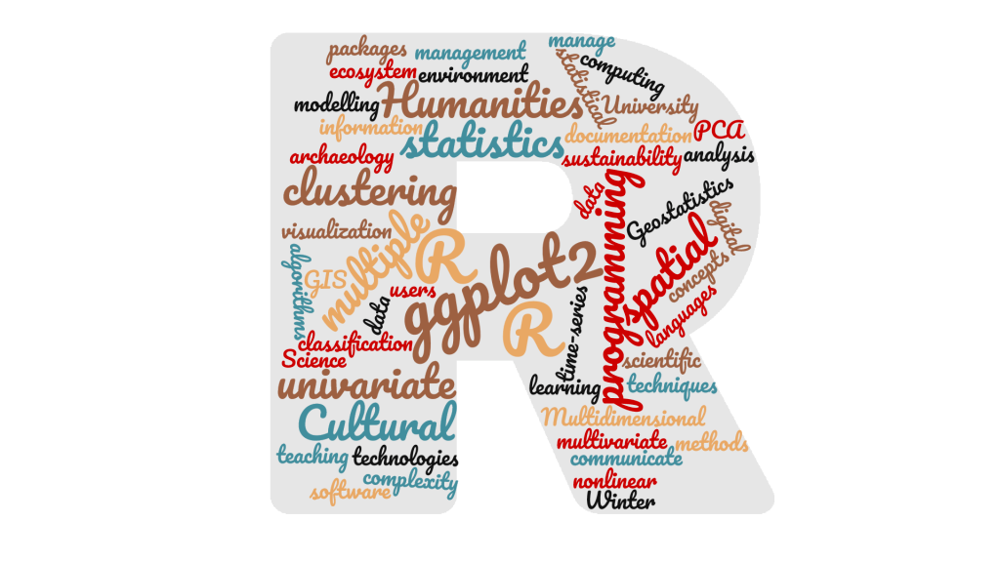

# Report with Rmarkdown 
> Reporting statistical analysis with Rmarkdown (*R4Archaeologists* Winter School, Universita di Pisa)  
> Thomas Huet, University of Oxford, February 2022

This training module consists of two parts and two documents:

---

### Part 1: R Markdown - Theory

* R markdown document: https://github.com/zoometh/oxford/blob/main/R4A/1_Rmarkdown_Theory.Rmd

* HTML render: https://zoometh.github.io/oxford/R4A/1_Rmarkdown_Theory  

---

### Part 2: R Markdown - Practice

* R markdown document: https://github.com/zoometh/oxford/blob/main/R4A/2_Rmarkdown_Practice.Rmd

* PDF render: https://github.com/zoometh/oxford/blob/main/R4A/2_Rmarkdown_Practice.pdf  

---
